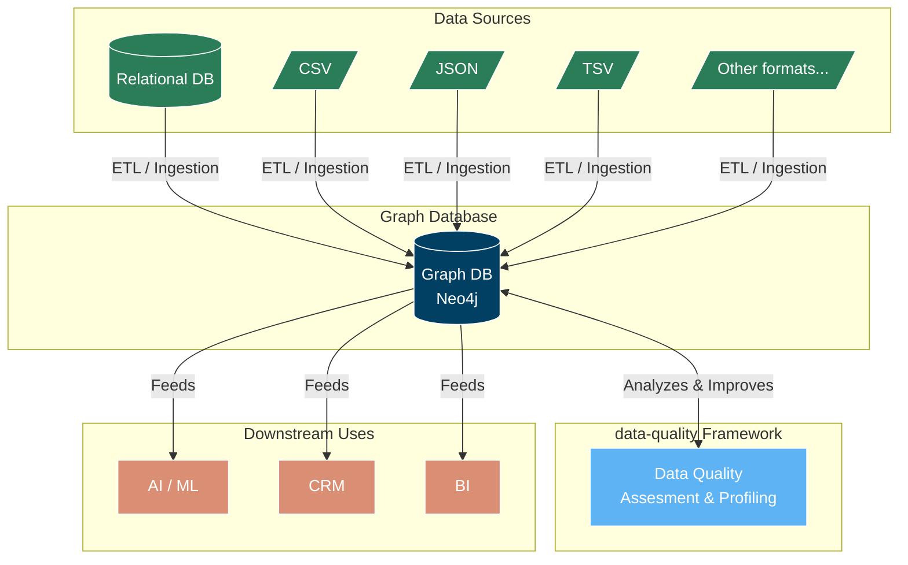

# data-quality
A reference implementation of the data quality metrics introduced in my **Master’s research project**, documented in ```doc/*/paper.typ``` (Property Graph Quality Assessment). This project provides a systematic framework for evaluating **completeness**, **validity**, **consistency**, **integrity**, and **uniqueness** in labeled property graphs (e.g., _Neo4j_).

## Architecture



## Why measure data quality in a property graph ?

Property graphs are schema‑flexible and semantically rich, but this freedom makes them prone to :
- Missing relationships or nodes → **completeness** issues
- Invalid label sets or malformed property values → **conformity** violations
- Inconsistent functional dependencies → **coherence** flaws
- Structural anomalies (duplicate edges, missing mandatory properties) → **integrity** / **uniqueness** degradation

Automated quality profiling helps:
- Validate graph‑based ETL pipelines
- Enforce domain constraints without a rigid schema
- Detect semantic drift in labels and relationships
- Improve downstream analytics (e.g., graph ML, path queries)

## Getting started

Requires Python 3.14 and [uv](https://github.com/astral-sh/uv).

```bash
# Clone the repository
git clone https://github.com/LugolBis/data-quality.git
cd data-quality

# Create virtual environment and install dependencies
uv venv .venv && source .venv/bin/activate && uv sync
```

Create a ```.env``` file and configure it :
```bash
echo '' > .env
```
and copy-paste in it
```plaintext
URI="neo4j://127.0.0.1:7687"
DB_USER="your_neo4j_user"
DB_PW="your_neo4j_password"
DB_NAME="your_database"
```

## Usage
Launch the interactive profiler (Streamlit UI) :
```bash
streamlit run src/main.py
```
Then :
1. Connect to a Neo4j database (or upload a Cypher dump).
1. Define constraints based on your domain rules.
1. Run the assessment and easily export them as CSV.
